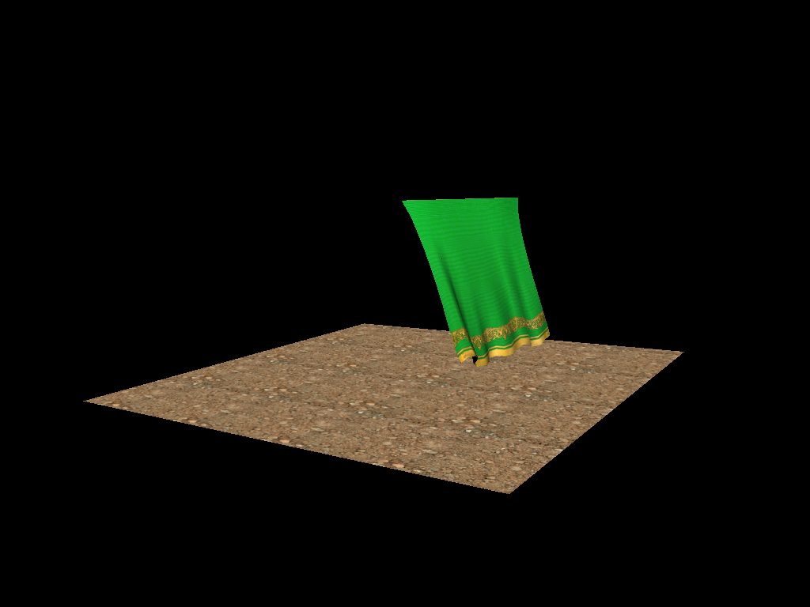

# SimCloth

## Установка и запуск

Для установки клонируйте репозиторий и соберите проект с помощью `Visual Studio`

Во время работы можно изменять режим отображения:
            По клавише 1 включается модель сетки
            По клавише 2 включается режим отображения нормалей
            По клавише 3 включается модель освещения Oren–Nayar
            По клавише 5 включается обычная модель освещения Ламберта
